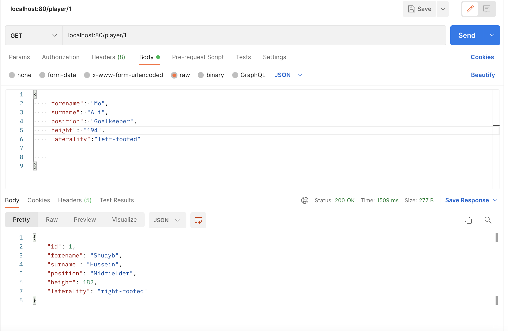
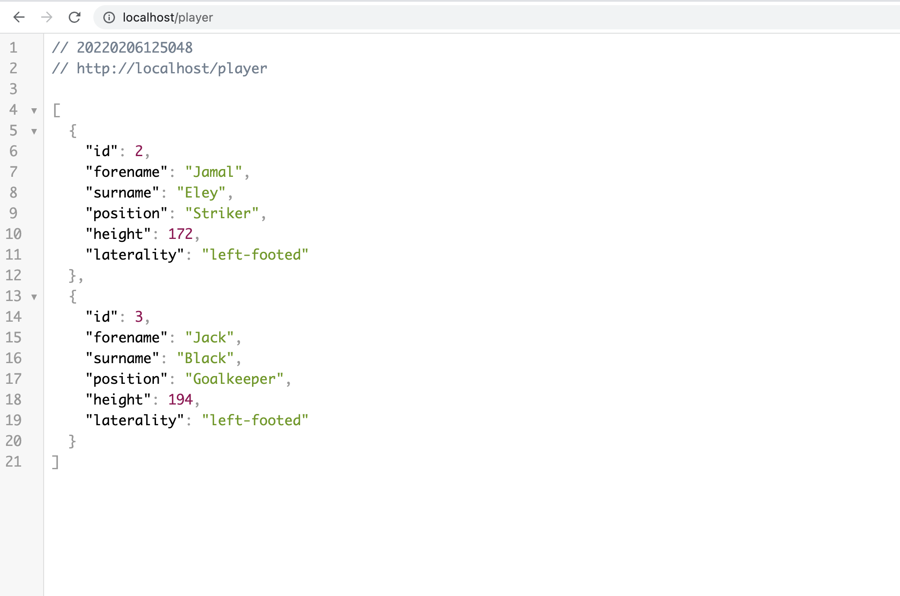
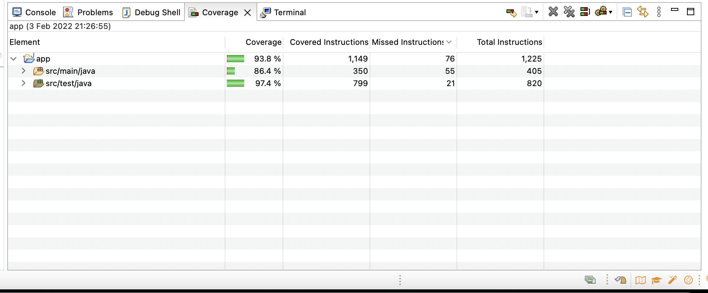

# QA-DFESW7-FINAL-PROJECT

## Links:
- [Jira Board](https://shuaibh97.atlassian.net/jira/software/projects/QDFP/boards/3)

## Tools used in the project:

- Agile & Project Management (Git, Jira)
- Databases & Cloud Fundamentals (H2, MySQL)
- Programming Fundamentals (Java)
- API Development (Spring Boot)
- Automated Testing (JUnit)

## Project Aims:
- Gain practical experience in using all the tools learned to create a working product
- Demonstrate my understanding of the tools learned on the bootcamp
- Have fun creating an application in a domain of interest

## Project objectives:
- To create a Spring Boot API, with utilisation of supporting tools, methodologies, and technologies, that encapsulates all fundamental and practical modules covered during training.

## Project requirements (Prioritisation using MoSCoW)

##	How I expected the challenge to go.

- I was confident in implementing the main concepts and deliverables required as part of the MVP. I anticipated some problems when it came to testing phase, however that process went smoothly.

## What went well? / What didn't go as planned?

Things that went well:
- Completed the deliverables checklist for the MVP
- Met > 50% of the stretch goals

Things that could have gone better:
- Implementing the rest of the stretch goals

## Possible improvements for future revisions of the project.

- Creating a Docker image of the application and deploying it to the cloud
- Hosting the database using a cloud provider
- Building a CI pipeline
- Creating a frond end for the application
- Creating a second table with a relationship

## Project Management (Jira)

## Completed Risk Assessment

## Screenshots showing the postman requests and the output from the API.

### Create

### Read

#### Read all players:

#### Read player by player ID:

### Update:

#### Before update:

#### After update

### Delete:

#### Before delete request:

#### Response from delete request:

#### Database after delete request:

## Screenshots showing persisted data in database 

The app was first connected to a MySQL database running on my local machine so that I could test that the API could successfully persist data on the local database.

>Database table using localhost:3306 server

### Connecting the spring boot app to a MySQL database using AWS Relational Database Service (RDS)

After successfully persisting the data to an MySQL instance on localhost, the next step was to provision a database on the cloud. I chose to provision the database on AWS using my free tier account.

#### 1. Configuring the database

##### 1.1 Choosing database type

##### 1.1. Generating credentials

##### 1.2. Attaching security groups

##### 1.3. Inbound rule configuration

Public access to the database was enabled and inbound rules was set to allow all HTTP/HTTPS requests to allow my spring boot app to connect to the database.

##### 1.4. Connecting to the database instance

##### 1.5 Creating the database playerApp

#### 2. Connecting app to remote database 

After successfully connecting to the database instance and creating the database, I was now able to use the database endpoint in the application production properties file in my spring boot app

##### 2.1 Setting the datasource URL as the database endpoint

##### 2.2 Testing a post request to the remote database

##### 2.3 Connecting to database from MySQL workbench

##### 2.4 

# Screenshot of the test results

