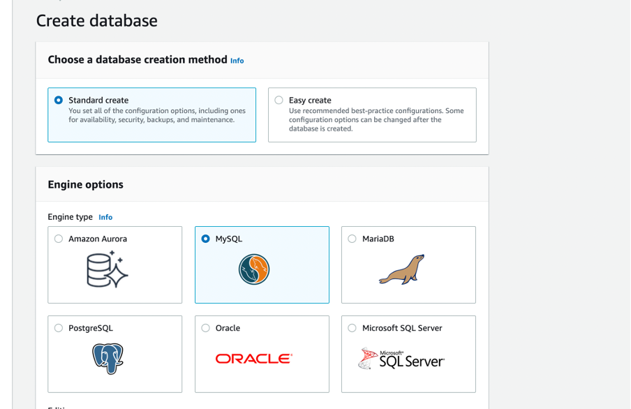

# QA-DFESW7-FINAL-PROJECT

## Contents

- [Overview](#overview)
- [Database setup](#1-setting-up-the-database-localhostaws)
- [Postman API requests](#2-screenshots-showing-the-postman-requests-and-the-output-from-the-api-using-remote-database)
- [Test results](#3-screenshot-of-the-test-results)
- [Using Docker](#4-dockerising-the-application)
- [CI pipeline](#5-ci-workflow)

## Overview:

### Tools used in the project:

- Agile & Project Management (Git, Jira)
- Databases & Cloud Fundamentals (H2, MySQL)
- Programming Fundamentals (Java)
- API Development (Spring Boot)
- Automated Testing (JUnit)
- AWS 
- Docker
- GitHub Actions

### Project Aims:
- Gain practical experience in using all the tools learned to create a working product
- Demonstrate my understanding of the tools learned on the bootcamp
- Have fun creating an application in a domain of interest

### Project objectives:
- To create a Spring Boot API, with utilisation of supporting tools, methodologies, and technologies, that encapsulates all fundamental and practical modules covered during training.


###	How I expected the challenge to go.

- I was confident in implementing the main concepts and deliverables required as part of the MVP. I anticipated some problems when it came to testing phase, however that process went smoothly.

### What went well? / What didn't go as planned?

Things that went well:
- Completed the deliverables checklist for the MVP
- Met > 50% of the stretch goals

Things that could have gone better:
- Implementing the rest of the stretch goals


### Possible improvements for future revisions of the project.

- Building a CD pipeline
- Creating a frond end for the application
- Running the Docker container on the cloud


### Project Management (Jira)

- [Jira Board](https://shuaibh97.atlassian.net/jira/software/projects/QDFP/boards/3)


### Completed Risk Assessment


- [Link to document](Documents/QA-Project_RiskAssessment.pdf)


### Entity Relationship Diagram (ERD)


- [Link to document](Documents/ERD.drawio)


## 1. Setting up the database (localhost/AWS)


The app was first connected to a MySQL database running on my local machine so that I could test that the API could successfully persist data on the local database. After confirming that the data was being persisted successfully, I proceeded to provision a MySQL database on AWS to connect the app to a remote database.

>Database table using localhost:3306 server


### 1.1. Connecting the spring boot app to a MySQL database using AWS Relational Database Service (RDS)

After successfully persisting the data to an MySQL instance on localhost, the next step was to provision a database on the cloud. I chose to provision the database on AWS using my free tier account.

#### 1.1.1 Configuring the database

> Choosing database type




> Generating credentials


> Attaching security groups


> Inbound rule configuration


Public access to the database was enabled and inbound rules was set to allow all HTTP/HTTPS requests to allow my spring boot app to connect to the database.

> Connecting to the database instance


> Creating the database playerApp


#### 1.2. Connecting app to remote database 

After successfully connecting to the database instance and creating the database, I was now able to use the database endpoint in the application production properties file in my spring boot app

##### 1.2.1. Setting the datasource URL as the database endpoint


##### 1.2.2. Testing a post request to the remote database


##### 1.2.3. Connecting to database from MySQL workbench


##### 1.2.4. Data being persisted on the remote database


## 2. Screenshots showing the postman requests and the output from the API using remote database

### 2.1. Create


### 2.2. Read

#### 2.2.1. Read all players:


#### 2.2.2. Read player by player ID:


### 2.3. Update:

#### 2.3.1. Before update:


#### 2.3.2. After update


### 2.4. Delete:

#### 2.4.1. Before delete request:


#### 2.4.2. Response from delete request:


#### 2.4.3. Database after delete request:


## 3. Screenshot of the test results


## 4. Dockerising the application

Useful links:
- [Connecting GitHub actions to Docker](https://docs.docker.com/ci-cd/github-actions/)


To extend the project and leverage the benefits of Docker, I decided to package and run the application using a Docker container on localhost. 

Dockerfile:


- [Link to the Dockerfile](app/Dockerfile)


### 4.1 Building the Docker image

To build and run a container from the Docker image for the application I ran the these commands in the application root directory:

#### 4.1.1. Building the Docker image tagged dockerplayerapp 

``` docker build -t dockerplayerapp .  ```

#### 4.1.2. Checking the Docker image exists locally:

``` docker image ls ```

#### 4.1.3. Running a Docker container from the image and mapping the host port 80 to the container port 80 which the app is running on:

``` docker run --name playerapp1 -p 80:80 -t dockerplayerapp ```

#### 4.1.4. Accessing the application running on port 80 on localhost:


## 5. CI workflow

To extend the project I setup a CI workflow using GitHub Actions and DockerHub.

The workflow yaml file can be found [here](.github/workflows/ci.yaml).

Diagram of CI workflow drawn on Draw.io:


Successful build of the workflow:


Docker image pushed to the DockerHub repositiory:


